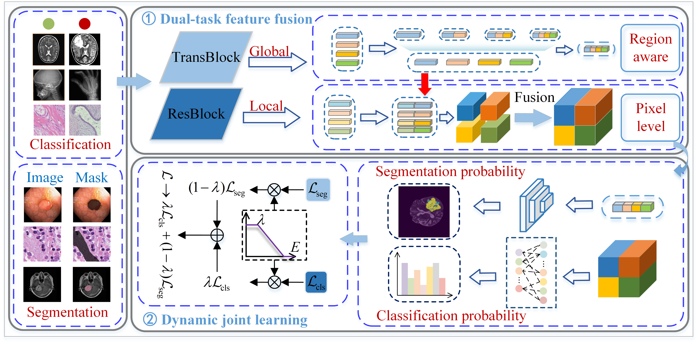

# DFDF: Dynamic Joint Learning Framework with Dual-task Feature Fusion for Medical Image Classification

## 🔒 Code Release Plan
The full source code will be made publicly available after the paper is formally accepted and published.
